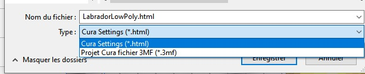
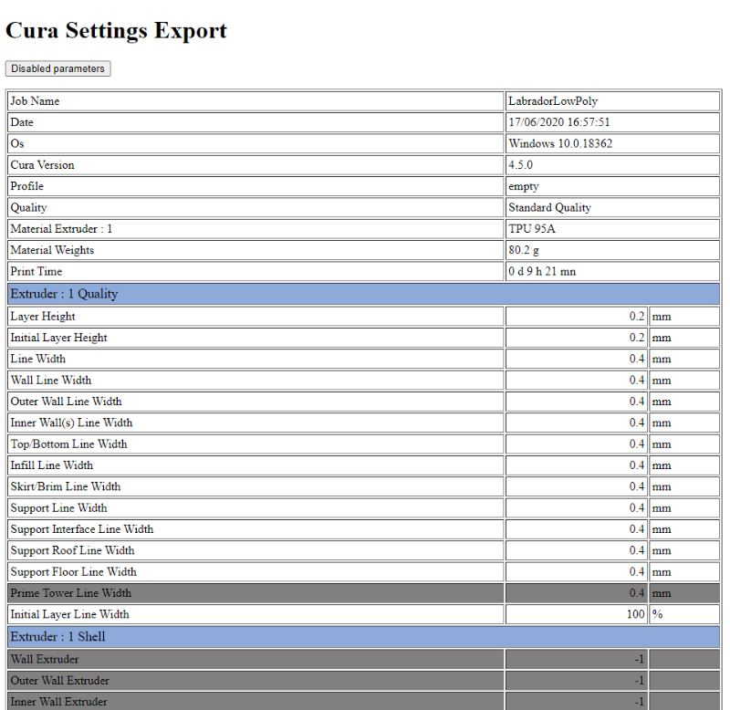

# Html Cura Settings
Cura Plugin for Exporting Settings to an HTML file.

Initial Source from Johnny Matthews :  [github.com/johnnygizmo/CuraSettingsWriter](https://github.com/johnnygizmo/CuraSettingsWriter)

It creates an extra menu option under File -> "Save Project..." that allows you to save all of the settings to an HTML file for review/sharing. 

Hereafter a sample screenshot of what you get as result.

## Modifications

- 1.0.3 Parameters are now translated in the native langage choosen in the Cura settings
- 1.0.4 Html cleanup, no more jquery dependency,  thanks to [etet100](https://github.com/etet100) 
- 1.0.5 For machine with multi extruder export the right extrudeur position and the information concerning the extruder Enabled
- 1.0.6 Fix Table width to 100% for printing purpose and export to pdf
- 1.0.7 Identify custom user modification on the top level of the settings with a green back color and add a button to hide normal settings
- 1.0.8 Options are also now translated in the native langage choosen in the Cura settings

- 1.1.0 New section top/bottom for Arachne or futur 4.9 release
- 1.1.1 Minor modification for the Ultimaker machine when it is not a profile that is defined but an intention, output the **activeIntentCategory** instead of the profile name
- 1.1.2 Minor modification for Arachne and Cura 4.9

